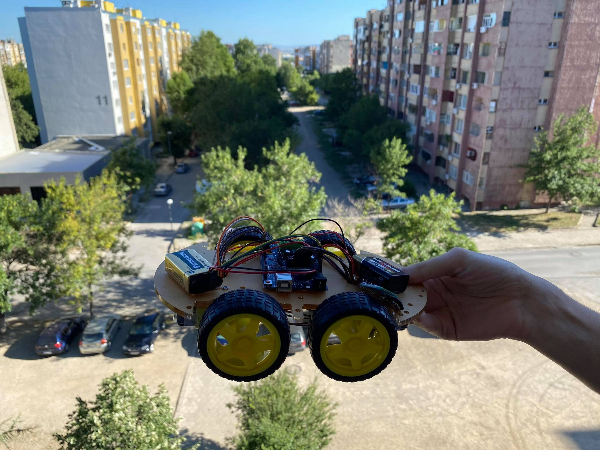
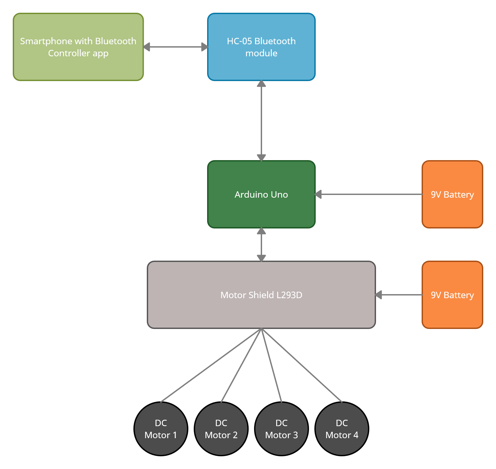

# ArduinoCart
A mobile car controlled via bluetooth.

## Documentation
### Prototype

### Block Diagram

## [Demo Video](https://www.youtube.com/watch?v=T8xIpon5gvk&feature=youtu.be&fbclid=IwAR1NrDBBVR8L--JqEa7qGZqoP6h-qw9kbWyr9eqnpLgVU9zIk7oyMSHnHe8)

### For more info about the project click [here](https://1drv.ms/w/s!AqdfJSRTIv-tiwKVOuZZD9b0sW7t?e=sbyfEm)
